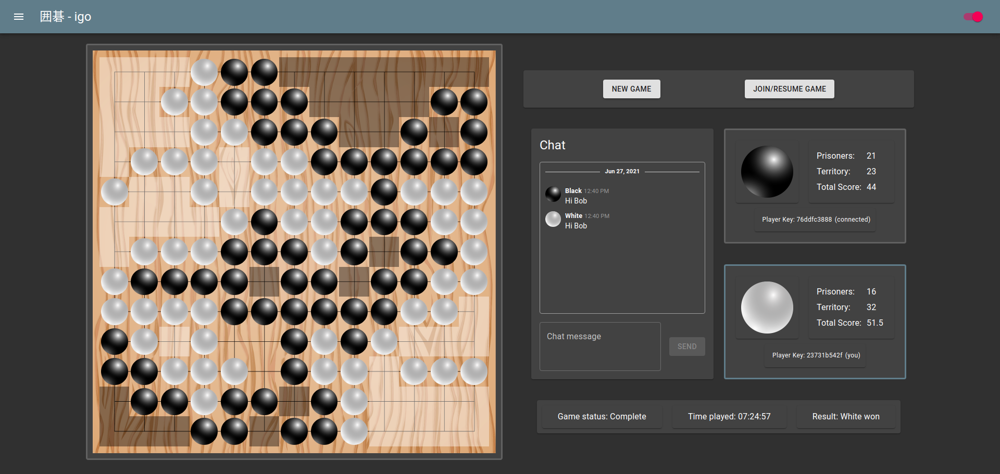

## igo-frontend

This is the frontend (user interface) code for a browser-based
[igo](<https://en.wikipedia.org/wiki/Go_(game)>) (囲碁, go) application, which you
can play [here](https://playigo.herokuapp.com/). The backend (game server) code
is [here](https://github.com/thisisrandy/igo-backend).

### Installation

Clone the repository and run `yarn install` from the root directory.

### Running locally

Run `yarn start` for the [react](https://reactjs.org/) development server and
`yarn build` for the production server. You will need an instance of the [game
server](https://github.com/thisisrandy/igo-backend) to be running, and
[ServerInfo.js](src/constants/ServerInfo.js) must be pointing to it. If you want
to play with other machines on the local network, change the address in
[ServerInfo.js](src/constants/ServerInfo.js) to your local IP address instead of
`localhost`.

### Technologies used

#### Production

- [clsx](https://github.com/lukeed/clsx) for constructing `className` strings
  conditionally
- [date-fns](https://github.com/date-fns/date-fns) for date munging
- [Jest](https://jestjs.io/) and [Testing Library](https://testing-library.com/) for UI testing
- [Material-UI](https://material-ui.com/) for a high-quality [Material
  Design](https://material.io/design) framework built in React
- [React](https://reactjs.org/) for UI building
- [React-Draggable](https://github.com/react-grid-layout/react-draggable) for
  draggable UI components
- [React Redux](https://github.com/reduxjs/react-redux) for React bindings to
  [Redux](https://github.com/reduxjs/redux) for state management
- [redux-websocket](https://github.com/giantmachines/redux-websocket) for Redux
  [middleware](https://redux.js.org/understanding/history-and-design/middleware)
  that manages data over a [WebSocket](https://en.wikipedia.org/wiki/WebSocket),
  facilitating communication with the [game
  server](https://github.com/thisisrandy/igo-backend)
- [SimpleBar](https://github.com/Grsmto/simplebar) for a custom-styled scrollbar

#### Development

- [Prettier](https://prettier.io/) for formatting
